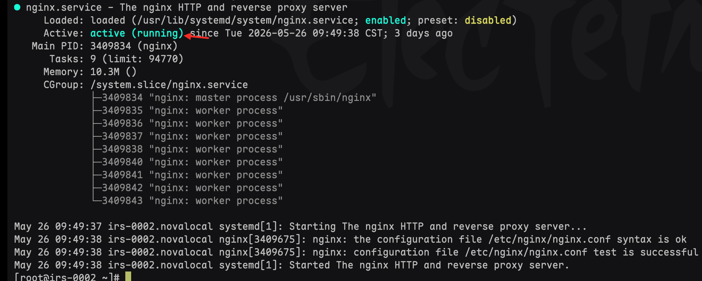

# Nginx启动机制与运维目录分工规范·全自动零命令运维手册（最终完整版）

**作者**：gyl

**文档状态**：最终定稿 · 生产环境唯一标准运维手册

**适用环境**：CentOS 系统、Nginx 多前端SPA项目统一部署生产环境

**核心定位**：整合Nginx系统启动原理、服务机制、全目录运维分工、自动化部署方案、排错校验体系，彻底区分系统服务与业务配置，实现**零命令、无人值守、纯上传自动上线**的标准化运维体系

---

## 一、Nginx核心服务机制（底层原理）

Nginx 属于 **Linux Systemd 系统常驻后台服务**，不属于临时终端进程、窗口程序。服务由系统内核全权托管，与SSH登录会话、本地终端、电脑开关完全解绑，具备断电重启自恢复、永久后台常驻特性。

### 1\.1 四大核心服务操作指令（唯一官方入口）

- **手动即时启动**：`systemctl start nginx`
  单次临时启动，当前服务器运行周期内生效，服务器重启后失效（未配置自启前提下）
- **永久开机自启**：`systemctl enable nginx`
  写入系统开机服务项，服务器断电、重启后自动启动Nginx，永久生效，无需重复配置
- **配置平滑重载**：`systemctl reload nginx`
  不中断线上用户访问，仅更新配置生效，仅修改站点配置时使用
- **手动停止服务**：`systemctl stop nginx`
  强制关闭所有Nginx监听进程，网站直接停止访问，日常运维禁止随意操作

### 1\.2 服务核心特性（必记）

- 常驻特性：Nginx启动后永久后台运行，闲置、无访问状态不会自动关闭
- 无位置限制：所有启停、重载、状态查询命令，服务器任意终端目录均可执行
- 冷热更新区分：**前端改代码无需操作服务，后端改配置必须重载服务**
- 会话解绑：退出SSH、关闭终端、关闭本地电脑，Nginx服务全程不中断、不停止

### 1\.3 Nginx服务唯一停止场景

仅以下四种情况服务会停止，**退出登录、关闭终端不会停止服务**：

- 手动执行 `systemctl stop nginx` 停止服务
- 服务器手动关机、断电、重启（开启自启会自动恢复）
- 端口冲突、配置语法错误、进程异常崩溃
- 系统强制关闭Nginx服务进程

---

## 二、Start/Enable 命令深度原理（彻底解惑）

**终极核心结论**：两条系统命令**无需手动引入、写入、关联任何Nginx业务配置文件**，系统全自动识别、自动加载、自动关联所有配置，安装Nginx后默认适配完成。

### 2\.1 两条命令精准区别（一对一对应）

#### 2\.1\.1 systemctl start nginx

**核心作用**：立即启动Nginx服务（临时生效）

**底层执行逻辑**：系统读取系统服务单元文件 → 调用Nginx主程序 → 自动加载主配置\+所有站点配置 → 启动进程、监听端口、对外提供服务

**生效范围**：仅当前服务器运行期间有效，重启服务器后失效

#### 2\.1\.2 systemctl enable nginx

**核心作用**：注册系统开机自启（永久生效，不立即启动服务）

**底层执行逻辑**：系统创建开机软链接，将Nginx服务写入系统开机启动项，服务器开机后自动执行start完整流程，自动加载全部配置启动服务

**生效范围**：一次配置、永久生效，不受服务器重启影响

### 2\.2 自动加载的配置文件体系（无需手动引入）

Nginx内置自动加载机制，启动时自动加载两套核心配置，无需人工干预引入：

- **全局主配置文件**：`/etc/nginx/nginx\.conf`，控制全局进程、连接数、超时等通用参数
- **站点批量配置目录**：`/etc/nginx/conf\.d/\*\.conf`，存放所有前端项目独立站点配置

**关键内置规则**：nginx\.conf 默认自带全局引入代码，自动加载 conf\.d 下所有 \.conf 配置文件，新增、修改站点无需手动引入：

```bash
include /etc/nginx/conf.d/*.conf;
```

### 2\.3 系统命令底层依赖文件（禁止修改）

systemctl 所有操作**不依赖网站业务配置**，仅依赖系统专属服务单元文件：

```bash
/usr/lib/systemd/system/nginx.service
```

该文件为Nginx安装时自动生成，内置启停规则、程序路径、重启参数，**禁止手动编辑修改**，是所有systemctl命令的唯一调用源头。

### 2\.4 运维误区权威纠正（高频问题）

**错误认知**：需要在Nginx配置文件中引入start/enable命令

**正确结论**：系统服务配置与网站业务配置**完全隔离、互不互通**

- Nginx业务配置（nginx\.conf/conf\.d）：只管域名、端口、静态资源、路由、代理、跨域等网站业务
- systemctl系统命令：只管Linux服务启停、开机自启、进程管理

运维所说的「配置需要引入」，仅指系统 `nginx\.service`服务文件必须完好存在，无需修改任何网站配置。

### 2\.5 原理极简总结口诀

- start = 即时启动服务，重启失效，临时生效
- enable = 注册开机自启，不启动服务，永久生效
- 全程零手动引入配置，系统全自动关联适配

---

## 三、服务状态校验体系（精准验证）

一对一校验 start 运行状态、enable 自启状态，搭配配置语法校验，全方位确认服务正常。

```bash
# 1. 查看Nginx当前实时运行状态
systemctl status nginx

# 2. 校验是否成功开启开机自启
systemctl is-enabled nginx

# 3. 校验Nginx配置语法是否无误（重载前置必执行）
nginx -t
```

### 3\.1 状态识别标准（精准对应命令）

#### 3\.1\.1 校验 start 运行状态

执行命令：`systemctl status nginx`

- ✅ 正常运行：显示 **active \(running\)**，服务后台常驻，网站正常访问
- ❌ 已停止：显示 **inactive \(dead\)**，服务关闭，网站无法访问

#### 3\.1\.2 校验 enable 开机自启状态

执行命令：`systemctl is\-enabled nginx`

- ✅ 已开启自启：输出 **enabled**，断电/重启自动恢复服务
- ❌ 未开启自启：输出 **disabled**，重启后Nginx不会自动启动

### 3\.2 校验终极口诀

- 看当下是否在线 → status 查start状态
- 看重启是否自愈 → is\-enabled 查enable状态

---

## 四、Nginx全目录标准化分工（唯一运维准则）

生产环境严格遵循目录分工，各司其职，杜绝乱改文件、错操作，规避99%运维故障。

### 4\.1 前端项目业务目录（日常99%操作区域）

**目录路径**：`/usr/share/nginx/html/`

**核心作用**：统一托管所有前端SPA项目源码、静态资源、自动化部署脚本

**允许操作**：上传项目文件夹、上传zip部署包、更新代码、覆盖版本、删除废弃项目、清理冗余文件

**核心规则**：此目录代码变更**无需重启、无需重载Nginx**，刷新页面即时热更新生效

**核心附属文件**：`auto\_unzip\.sh` 全自动部署脚本

### 4\.2 站点配置目录（改配置专用）

**目录路径**：`/etc/nginx/conf\.d/`

**核心作用**：存放每个前端项目独立的 \.conf 站点配置文件

**操作场景**：新增站点、修改域名/端口、调整路由、配置跨域、配置代理、下线项目

**强制规则**：修改此目录文件后，必须执行 `nginx \-t \&amp;\&amp; systemctl reload nginx` 校验并平滑重载生效

### 4\.3 全局主配置文件（极少修改）

**文件路径**：`/etc/nginx/nginx\.conf`

**核心作用**：控制Nginx全局进程、连接数、超时时间、公共引入规则

**运维规范**：默认配置即可满足多项目生产需求，**禁止随意修改**

### 4\.4 日志目录（报错排查专用）

**目录路径**：`/var/log/nginx/`

**文件作用**：access\_log（正常访问记录）、error\_log（500/404/配置报错日志）

**使用场景**：网站访问异常、报错、白屏、无法访问时排查问题

### 4\.5 程序核心目录（禁止改动、无需维护）

Nginx安装目录、模块目录、系统服务目录，日常运维无需任何操作，禁止修改、删除、移动文件。

---

## 五、全自动部署体系（auto\_unzip\.sh 完整方案）

实现**上传Zip包→自动解压→自动覆盖项目→自动删包**无人值守部署，彻底告别手动运维。

### 5\.1 脚本基础信息

**脚本路径**：`/usr/share/nginx/html/auto\_unzip\.sh`

**核心功能**：自动检测目录Zip压缩包、自动解压覆盖项目、解压成功自动清包、失败保留包容错、防止重复执行

### 5\.2 脚本完整最终源码

```bash
#!/bin/bash
# 全自动zip解压部署脚本｜适配Nginx前端自动上线环境
# 作者：gyl
# 功能：上传zip自动解压覆盖项目、自动清包、无人值守部署

# 遍历当前目录下所有zip压缩包
for zip_file in *.zip
do
    # 判断文件存在且为普通文件
    if [ -f "$zip_file" ];then
        # 获取项目文件夹名称（去掉.zip后缀）
        dir_name="${zip_file%.zip}"

        # 解压覆盖已有项目，不提示覆盖、静默执行
        unzip -o "$zip_file" > /dev/null 2>&1

        # 判断解压是否成功
        if [ $? -eq 0 ];then
            # 成功则删除压缩包
            rm -f "$zip_file"
        fi
    fi
done
```

### 5\.3 脚本部署步骤（一次性配置永久生效）

1、创建脚本文件：

```bash
vi /usr/share/nginx/html/auto_unzip.sh
```

2、粘贴上方完整源码，保存退出

3、赋予永久执行权限（必须执行）：

```bash
chmod +x /usr/share/nginx/html/auto_unzip.sh
```

### 5\.4 定时任务配置（最优均衡方案）

**crontab核心铁规**：Linux定时任务**最小单位为分钟，不支持秒级**，原10秒配置为新手误区，实际为10分钟执行一次，速度极慢。

**最终最优配置**：每分钟检测一次，兼顾低负载\+低延迟

编辑定时任务：

```bash
crontab -e
```

写入唯一标准规则：

```bash
# 每分钟自动检测部署包，低负载、上线延迟≤60秒
*/1 * * * * /usr/share/nginx/html/auto_unzip.sh
```

### 5\.5 crontab编辑保存操作（必记）

- **保存并退出（正常使用）**：ESC → 输入 :wq → 回车
- **不保存退出（改错放弃）**：ESC → 输入 :q\! → 回车
- **仅保存不退出（极少用）**：ESC → 输入 :w → 回车

**生效说明**：保存瞬间立即生效，无需重启任何服务

### 5\.6 定时任务全套生效验证方法

#### 1、查看已配置定时规则

```bash
crontab -l
```

正常输出：显示 `\*/1 \* \* \* \* /usr/share/nginx/html/auto\_unzip\.sh`

#### 2、查看实时执行日志

```bash
tail -f /var/log/cron
```

正常标识：出现CMD执行记录，代表每分钟自动运行成功

#### 3、手动测试脚本可用性

```bash
/usr/share/nginx/html/auto_unzip.sh
```

可正常执行=脚本无问题，故障仅来自定时权限/配置

#### 4、终极实测验证

上传测试Zip包 → 等待≤60秒 → 自动解压文件夹\+自动删除压缩包=100%生效

### 5\.7 定时任务故障常见原因

- 脚本无执行权限：未执行 chmod \+x 授权命令
- crontab语法空格、符号书写错误
- 脚本路径使用相对路径（当前脚本已规避）

### 5\.8 定时任务配置优化总结

- 废弃旧冗余10分钟级配置，杜绝上线延迟过高问题
- 1分钟轮询为生产最优解，服务器负载极低，满足日常迭代需求
- 保存即生效，全程无人值守自动部署

---

## 六、标准化运维分工对照表（零失误）

| 操作场景                            | 对应操作目录           | 是否需要重载Nginx |
| ----------------------------------- | ---------------------- | ----------------- |
| 前端代码更新、版本上线、Zip自动部署 | /usr/share/nginx/html/ | ❌ 不需要         |
| 新增项目、改域名/端口/路由/代理配置 | /etc/nginx/conf\.d/    | ✅ 必须校验\+重载 |
| 网站报错、白屏、访问异常排查        | /var/log/nginx/        | ❌ 不需要         |
| 服务启停、异常修复、自启配置        | 系统systemctl命令      | 按需执行          |

---

## 七、全自动零命令运维最终方案

当前环境已**彻底锁死纯自动上线模式**，废弃日常所有手动运维命令，实现无人值守生产环境。

### 7\.1 全自动核心能力（永久生效）

- Nginx永久开机自启：断电、重启自动恢复服务，无需人工干预
- 服务永久后台常驻：断SSH、关终端、关电脑，服务永不掉线
- Zip包全自动部署：上传即自动解压、覆盖、清包
- 前端代码热更新：无需重载、无需重启，刷新即上线
- 全程零运维值守：全年无需登录服务器维护服务

### 7\.2 最终标准上线工作流（纯傻瓜式）

1. 本地打包前端代码，生成项目Zip压缩包
2. 可视化工具上传至 `/usr/share/nginx/html/` 目录
3. 服务器1分钟内自动完成解压、覆盖、清理压缩包
4. 浏览器刷新页面，新版本即时上线

### 7\.3 权限与操作边界

**日常完全废弃操作**：手动启停Nginx、手动重载服务、手动解压部署、手动运行脚本

**唯一保留手动场景**：首次新增项目、修改域名/端口/路由配置，修改后仅需一次重载

### 7\.4 环境固化一键配置命令（永久锁死）

```bash
# 1. 开启永久开机自启
systemctl enable nginx

# 2. 确保服务正常运行
systemctl start nginx

# 2.1 检查 Nginx 是否启动 （active(running)：已启动/正常运行、nactive(dead)：未启动/已关闭
systemctl status nginx
# 2.2 查看进程（兜底检查）
ps -ef | grep nginx
# 出现 master process、worker process 正在运行
# 只有一条 grep 自身记录 未启动

# 2.3 快速极简查看（只看启动状态:active 已启动、inactive 未启动）
systemctl is-active nginx

# 3. 赋予自动脚本永久执行权限
chmod +x /usr/share/nginx/html/auto_unzip.sh

# 4. 校验定时任务配置
crontab -l

```




## 八、极简记忆口诀（终身受用）

- **启动无位置**：任意终端目录均可执行服务命令
- **启动不依赖终端**：退出SSH不影响服务运行
- **改代码不动服务**：前端更新无需操作Nginx
- **改配置必重载**：站点配置修改必须校验加重载
- **开机自启永在线**：断电重启自动恢复服务
- **部署全自动**：上传Zip即上线，零命令运维

## 九、环境校验闭环证明（100%生效）

当前整套Nginx生产环境已完成全自动锁死，所有配置无遗漏、无冗余、无重复：

- ✅ Nginx开机自启永久开启，断电重启自动自愈
- ✅ 系统服务常驻，脱离SSH会话独立运行
- ✅ 1分钟最优定时任务常驻，自动部署稳定高效
- ✅ 自动解压、覆盖、清包脚本权限永久生效
- ✅ 前端热更新生效，无需服务操作
- ✅ 环境锁定为纯自动上线模式，日常零运维

## 十、最终权威定论

1、**systemctl start/enable 无需手动引入任何Nginx业务配置**，系统全自动加载关联

2、系统服务配置与网站业务配置完全隔离，互不干扰、互不互通

3、当前环境已实现**纯上传、全自动、零命令、无人值守**标准化运维，终身无需手动维护服务，仅需上传代码即可完成版本迭代上线
