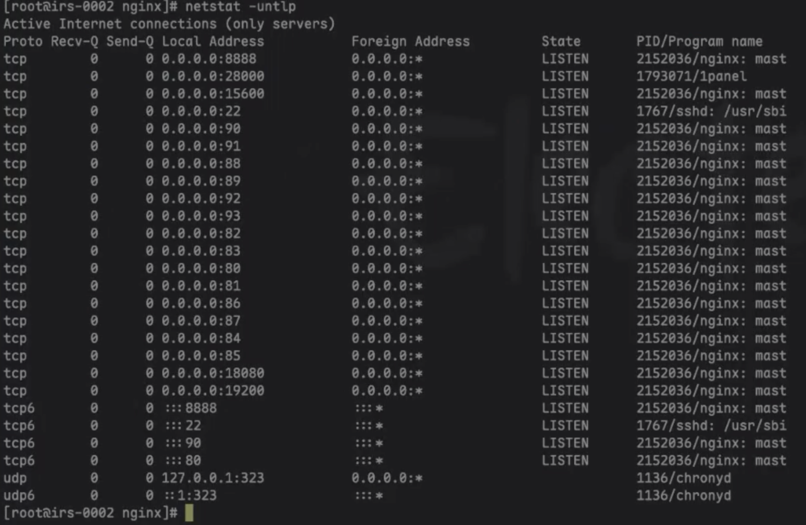

# openEuler 24\.03 ARM 环境 Nginx1\.24\.0 离线升级1\.30\.0 完整运维文档

## （零丢数据、全报错修复）

## 一、升级环境与前置说明

### 1\.1 环境信息

- 操作系统：openEuler 24\.03 LTS（aarch64 ARM架构）
- 旧版本：Nginx 1\.24\.0
- 目标版本：Nginx 1\.30\.0（官方稳定版）
- 业务场景：部署前端静态项目（irs\-portal），需保留所有上传文件、站点配置

### 1\.2 升级核心限制（全程踩坑根源）

- 服务器外网源超时、443端口无法连通，所有 YUM/DNF 在线源（CentOS源、Oepkgs源）全部失效，**无法在线安装升级**
- openEuler 系统不兼容 CentOS 官方 Nginx 源，强行使用会报 404、元数据下载失败
- 仅支持**源码离线编译升级**，唯一可行方案
- 核心要求：不卸载旧业务、不删除前端上传资源、不丢失原有站点配置

### 1\.3 升级前置备份（必执行，保障数据安全）

全程备份配置与静态资源，杜绝数据丢失

```bash
# 备份Nginx全部配置文件
cp -r /etc/nginx /etc/nginx_bak_1.24.0
# 备份前端静态资源文件
cp -r /usr/share/nginx/html /usr/share/nginx/html_bak
```

## 二、环境预处理：清理失效源、修复依赖报错

### 2\.1 删除所有失效外网源

清理超时、404的无效源，避免后续命令卡死报错

```bash
rm -f /etc/yum.repos.d/nginx.repo
rm -f /etc/yum.repos.d/oepkgs.repo
dnf clean all
```

### 2\.2 禁用失效Oepkgs源

```bash
dnf config-manager --disable oepkgs
```

### 2\.3 安装本地编译依赖（系统默认源）

跳过外网源，使用系统自带源安装编译所需依赖，解决依赖缺失问题

```bash
dnf install -y gcc make zlib-devel pcre-devel openssl-devel
```

## 三、Nginx1\.30\.0 离线源码编译安装

### 3\.0 停止旧版本并清理残留文件

```bash
# 确认是否有正在运行的nginx进程
ps -ef | grep nginx
# 优雅停止nginx服务
/usr/sbin/nginx -s stop
# 删除/etc下的nginx目录（后续使用/usr/local/nginx）
rm -rf /etc/nginx
# 删除旧版本二进制文件
rm -f /usr/sbin/nginx
```

### 3\.1 下载官方源码包（无404、可正常下载）

放弃失效阿里云镜像，使用Nginx官方包地址

```bash
cd /usr/local
wget http://nginx.org/download/nginx-1.30.0.tar.gz
tar -zxvf nginx-1.30.0.tar.gz
cd nginx-1.30.0
```

### 3\.2 合规编译配置

```bash
./configure \
--prefix=/usr/local/nginx \
--with-http_ssl_module \
--with-http_v2_module \
--with-stream \
--with-stream_ssl_module \
--with-stream_realip_module \
--with-stream_ssl_preread_module
```

### 3\.3 编译与版本替换（无损升级核心）

仅编译不安装，备份旧版本二进制文件，覆盖替换为新版，不改动任何业务配置

```bash
# 编译源码
make
make install
# 备份旧1.24.0程序 (如有必要)
cp /usr/sbin/nginx /usr/sbin/nginx_1.24.0_bak
```

```bash
cd /usr/local/nginx
ls
# conf html logs sbin
cd ./sbin/nginx
ls
# client body temp conf fastcgi temp html logs proxy temp sbin scgi temp uwsgi temp (正常会有这些文件)
# 手动创建modules
mkdir modules
# conf 里面创建conf.d
cd conf
mkdir conf.d
# nginx.conf 修改为正确的， conf.d 里面的也配置

cd ..
# 检测下， 解决对应错误
./sbin/nginx -t 
# [root@irs-0002 nginx]# ./sbin/nginx -t
# nginx: [emerg] directive "include" is not terminated by ";" in /usr/local/nginx/conf/nginx.conf:97I
# nginx: configuration file /usr/local/nginx/conf/nginx.conf test failed

./sbin/nginx -t  # 代表ok
# nginx: the configuration file /us/local/nginx/conf/nginx.conf syntax is ok
# nginx: configuration file /usr/local/nginx/conf/nginx.conf test is successful

# 重启下
./sbin/nginx -s reload
# 查看端口在不在
netstat -untlp
```

- netstat -untlp 端口都起来了



## 五、最终校验与服务启动

```bash
# 刷新系统服务缓存
systemctl daemon-reload
# 校验配置语法（必须成功）
nginx -t
# 启动并设置开机自启
systemctl start nginx
systemctl enable nginx
# 查看运行状态
systemctl status nginx
# 验证升级版本
nginx -v
```
